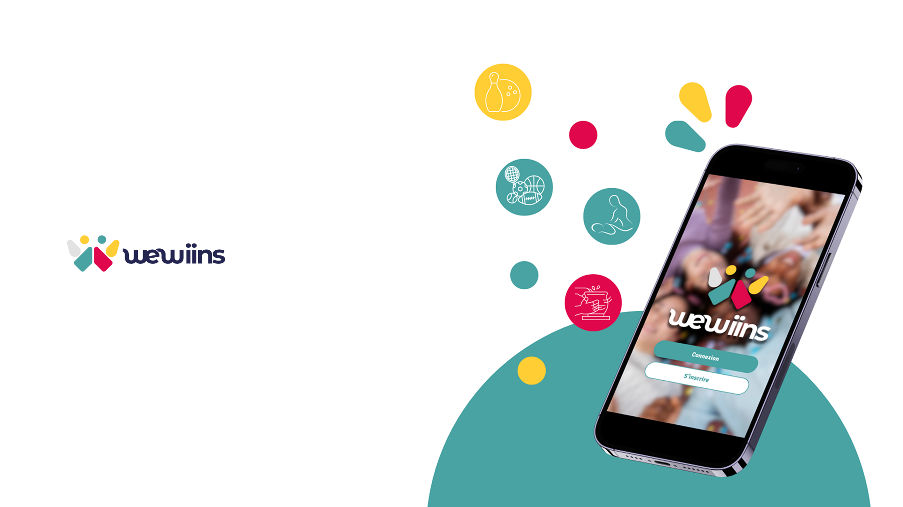

# WeWiins



WeWiins est une **plateforme digitale** qui transforme le divertissement pour les jeunes actifs de 18 à 29 ans.  
Elle simplifie la découverte et l'organisation d'activités comme le cinéma, la cuisine, le karting ou l'escalade, et collabore avec des entreprises de divertissement pour offrir une large variété d'options.

Les utilisateurs bénéficient de :
- Bons plans et offres exclusives
- Messagerie et planification d'événements
- Réservation facile et paiement sécurisé
- Partage d'avis et recommandations

La plateforme est **gratuite**, avec des options premium et se finance via une **commission sur les réservations**.  
Elle débute dans les **Alpes-Maritimes**, avec une **prévision d’extension en France puis en Europe**.

## Architecture du projet

Le projet est un **monorepo**, organisé comme suit :

```
apps/
├─ api
├─ client
├─ keycloak
├─ keycloak-theme
├─ scripts
packages/
├─ shared
```

### Détails des projets

| Projet            | Description |
|------------------|-------------|
| **api**           | Projet Java/Kotlin Spring Boot. Architecture en couches, API REST pour exposer toutes les fonctionnalités de WeWiins. |
| **client**        | Projet Angular, contient le dashboard principal pour les prestataires de services (gestion des activités, réservations, suivi des utilisateurs). |
| **keycloak**      | Gestion des authentifications et des accès, basé sur Keycloak. |
| **keycloak-theme**| Projet facilitant la personnalisation graphique du processus d’authentification (login, création de compte, réinitialisation de mot de passe). |


## Installation

Pour installer et lancer le projet en local, suivez ces étapes :

1. **Cloner le repository**
```bash
git clone <URL_DU_REPO>
```
ou via SSH
```bash
git clone git@github.com:<USERNAME>/wewiins.git
```

2. **Configurer les variables d'environnement**
   - Pour le projet `api` (Spring Boot)
   - Pour le projet `client` (Angular)
   
3. **Builder le projet keycloak-theme**
```bash
npm run build
keycloakify build
```
- Déplacer le `.jar` généré dans le dossier `providers` du projet `keycloak`

4. **Builder le projet keycloak**
- Suivre le README du projet `keycloak`
- Placer le `.jar` dans le dossier `providers` correspondant

5. **Lancer Docker**
```bash
docker-compose up -d
```
- Cela démarrera tous les services nécessaires (API, client, Keycloak, etc.)

6. **Accéder à la plateforme**
- Ouvrir `http://localhost:8080`
- Se connecter sur Keycloak
- Configurer Keycloak pour utiliser le thème personnalisé `keycloak-theme`

**C’est prêt !** 🎉


## Fonctionnalités clés

- Découverte et réservation d’activités
- Dashboard pour prestataires
- Gestion des utilisateurs et des rôles
- Paiement sécurisé et suivi des transactions
- Offres premium et bons plans
- Notifications et messagerie


## Contributions

Pour contribuer au projet :

1. Fork le repository
2. Créer une branche feature (`git checkout -b feature/nom-de-la-feature`)
3. Commit vos changements (`git commit -m 'Description de la feature'`)
4. Push sur la branche (`git push origin feature/nom-de-la-feature`)
5. Créer un Pull Request

